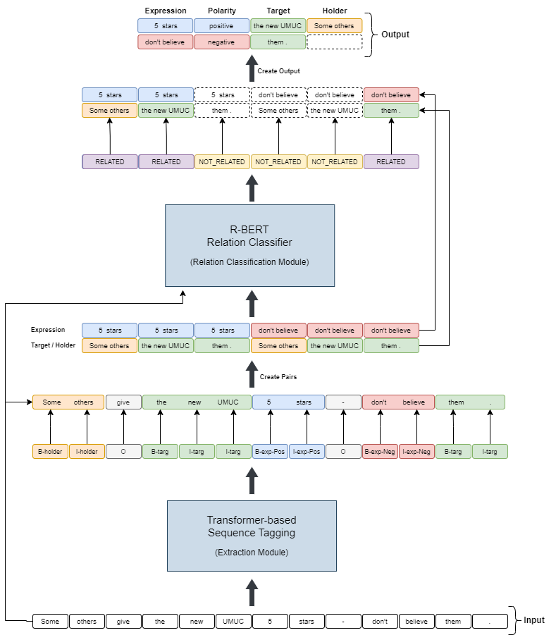

# OPI at SemEval-2022 Task 10: Structured Sentiment Analysis
This is the source code of my solution for the [SemEval-2022 Shared Task 10: Structured Sentiment Analysis](https://competitions.codalab.org/competitions/33556) which is
described in the paper: 
[OPI at SemEval-2022 Task 10: Transformer-based Sequence Tagging with Relation Classification for Structured Sentiment Analysis](https://aclanthology.org/2022.semeval-1.190/).

If you use the code from this repository, please cite:

```
@inproceedings{poswiata-2022-opi,
    title = "{OPI} at {S}em{E}val-2022 Task 10: Transformer-based Sequence Tagging with Relation Classification for Structured Sentiment Analysis",
    author = "Po{\'s}wiata, Rafa{\l}",
    booktitle = "Proceedings of the 16th International Workshop on Semantic Evaluation (SemEval-2022)",
    month = jul,
    year = "2022",
    address = "Seattle, United States",
    publisher = "Association for Computational Linguistics",
    url = "https://aclanthology.org/2022.semeval-1.190",
    doi = "10.18653/v1/2022.semeval-1.190",
    pages = "1366--1372",
}
```

## Problem description

**Structured Sentiment Analysis (SSA)** can be formulated as an information extraction task in which one attempts to find 
all of the opinion tuples *O* = *O*<sub>i</sub>,...,*O*<sub>n</sub> in a text. Each opinion *O*<sub>i</sub> is a tuple
*(h, t, e, p)* where *h* is a **holder** who expresses a **polarity** *p* towards a **target** *t* through a 
**sentiment expression** *e*, implicitly defining pairwise relationships between elements of the same tuple
[(Barnes et al., 2021)](https://aclanthology.org/2021.acl-long.263/). An example of such tuples as a structure sentiment graph is Figure 1. 

<p style="text-align: center">
  
</p>
<div style="text-align: center">Figure 1: SSA example as a structure sentiment graph.</div>

## Subtasks

### Monolingual

In the monolingual sub-task, the systems were trained and then tested on the datasets in the same languages. Seven 
structured sentiment datasets in five languages selected for the competition are shown in Table 1.

| Dataset | Language | Type of data | # sents | # holders | # targets | # expr. |
| --------| -------- | ------- | ------- | --------- | --------- | ------- |
| [MPQA](http://mpqa.cs.pitt.edu/) | English | News | 10048 | 2279| 2452 | 2814 |
| [DS<sub>unis</sub>](https://tudatalib.ulb.tu-darmstadt.de/handle/tudatalib/2448) | English | Reviews of online universities <br/> and e-commerce | 2803 | 86 | 1119 | 1119 |
| [OpeNER<sub>en</sub>](http://journal.sepln.org/sepln/ojs/ojs/index.php/pln/article/view/4891) | English | Hotel reviews | 2494 |413 |3850 |4150 |
| [OpeNER<sub>es</sub>](http://journal.sepln.org/sepln/ojs/ojs/index.php/pln/article/view/4891) | Spanish | Hotel reviews | 2057 |255 |3980 |4388 |
| [MultiBooked<sub>ca</sub>](https://aclanthology.org/L18-1104/) | Catalan | Hotel reviews | 1678 |235 |2336 |2756 |
| [MultiBooked<sub>eu</sub>](https://aclanthology.org/L18-1104/) | Basque | Hotel reviews | 1521 |296 |1775 |2328 |
| [NoReC<sub>fine</sub>](https://aclanthology.org/2020.lrec-1.618/) | Norwegian | Multi-domain reviews | 11437 | 1128|8923 |11115 |
Table 1: Datasets used during competition.

### Cross-lingual

In the cross-lingual sub-task, systems had to be prepared for Catalan, Basque and Spanish datasets, while data in these 
languages could not be used for training. This setup is often known as zero-shot cross-lingual transfer [(Hu et al., 2020)](https://arxiv.org/abs/2003.11080).

## Solution

The architecture of our solution is shown in Figure 2. It consists of two main components: Extraction Module and 
Relation Classification Module. The first module is based on sequence tagging and is used to extract targets, holders 
and expressions with polarity. Having already extracted entities, the role of the second module is to classify whether 
there is a relationship between them.

<p style="text-align: center">
  
</p>
<div style="text-align: center">Figure 2: Architecture of the proposed solution.</div>

## Results

Evaluation of the systems was based on the official competition metric i.e. **Sentiment Graph F1 (SF1)**. My system achieved 
average SF1 scores of **54.5%** and **53.1%** for the monolingual and cross-lingual sub-tasks, respectively. This allowed me 
to place 11th and 9th out of 32 teams in these subtasks.


| Dataset | Monolingual | Cross-lingual |
| --------| -------- | ------- | 
| **MPQA** | 32.6 | - |
| **DS<sub>unis</sub>** | 39.5 | - |
| **OpeNER<sub>en</sub>** | 67.0 | - |
| **OpeNER<sub>es</sub>** | 66.3 | 56.4 |
| **MultiBooked<sub>ca</sub>** | 65.0 | 58.6 |
| **MultiBooked<sub>eu</sub>** | 65.3 | 44.4 |
| **NoReC<sub>fine</sub>** | 45.9 | - |
| **Average score** | **54.5** | **53.1** |
Table 2: Official competition results of proposed solution.
